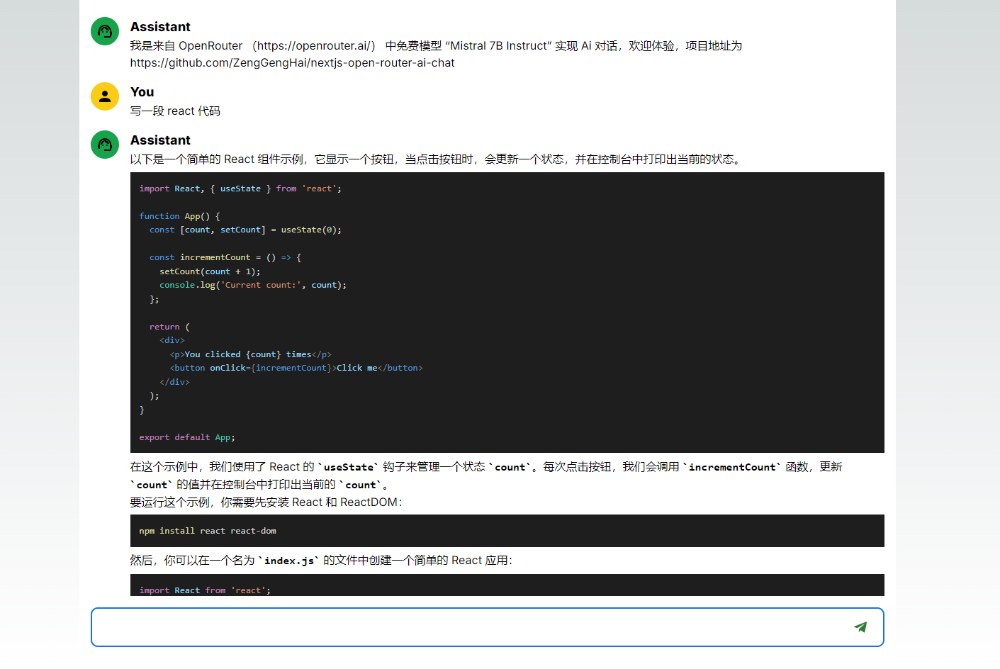

# OpenRouterAiChat

基于 https://openrouter.ai/ 里面提供的免费 model “Mistral 7B Instruct”作为 ai provider 为基础开发聊天对话机器人

### 体验步骤

体验网址（需科学上网访问）：https://nextjs-open-router-ai-chat.vercel.app

在 https://openrouter.ai/ 申请 key 并在弹窗中填写（key 是保存在 localStorage 中，目前填错或想修改得去控制台清空 aiKey ）

### 技术栈

- create-react-app
- mui
- react-markdown
- tailwindCss
- typescript

### 版本

- node v20.12.0
- pnpm 8.15.4

### 运行

pnpm install

pnpm run dev

### 待办

交互

- ai-key 弹窗设置按钮
- ai-key 报错重新唤起填写弹窗
- 黑白主题色
- 词条文案国际化

架构

- prettier 代码风格以及格式化
- husky git 钩子，pre-commit 执行 lint-staged 命令
- lint-staged 对 git 暂存区文件使用 prettier 格式化代码后用 esLink 检测代码情况
